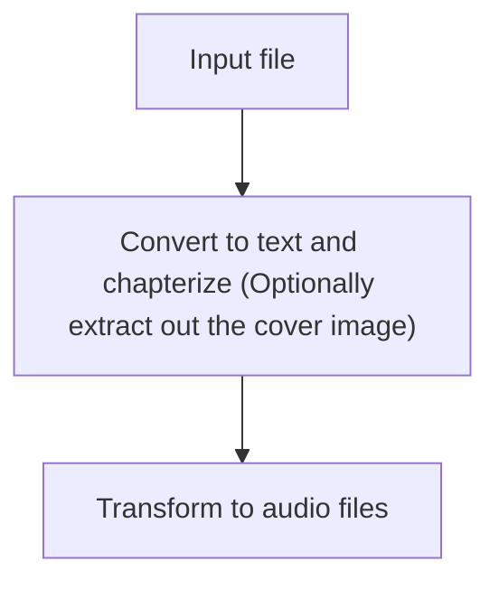

gen-audio - Generate Audio from Text
====================================

## Flow

## Usage

This project uses `uv` for dependency management and running the program, to run it after cloning the source to your local directory, run `uv sync` to create the virtual environment in the `.env` directory and download all the dependencies. The run the following commands to perform the conversion:

`uv run -v main.py <epub path> <audio output directory>`

You can use the following epub for testing:
https://github.com/daisy/epub-accessibility-tests/releases/download/fundamental-2.0/Fundamental-Accessibility-Tests-Basic-Functionality-v2.0.0.epub