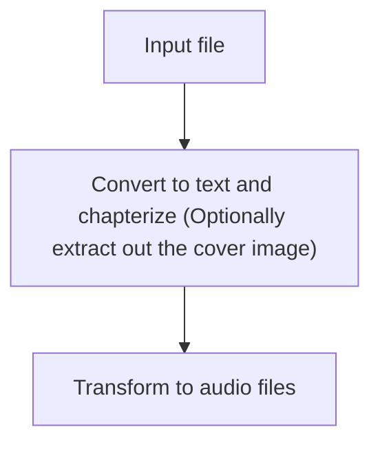

gen-audio - Generate Audio from Text
====================================

## Flow


## Usage

### Chapterize

To convert an EPUB file into text files per chapter and extract the cover image:

```python
from chapterize import Chapterizer

epub_path = 'path/to/your/book.epub'
output_dir = 'path/to/output/directory'

chapterizer = Chapterizer(epub_path, output_dir)
chapterizer.extract_cover()  # Extract just the cover image
chapterizer.chapterize()     # Extract chapters and cover image
```

The cover image will be saved as 'cover.jpg' in the output directory.